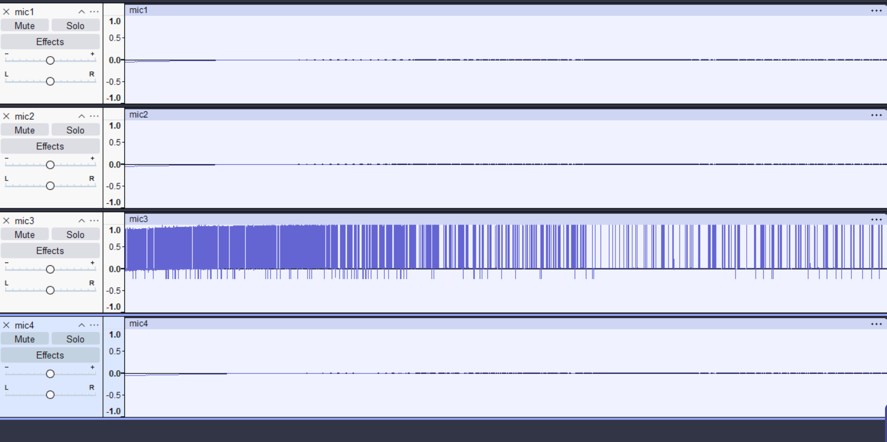
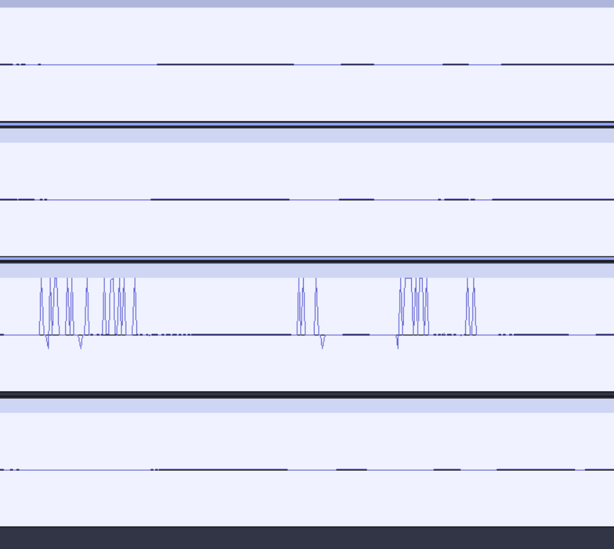

# Multi Microphone Verification

This test confirms that all microphones are capable of accurately capturing environmental audio data

## Test Summary

- **Objective:** Validate the functionality of all 4 microphones in capturing audio.
- **Result:** Successful. The converted files clearly captured the spoken phrase:
*"Audio360"*; although the recorded data is cut off at the start.

## Technical Notes

Code adjustments are necessary to ensure microphone buffer data is written at the end of the collection process.
This prevents loss of audio samples.
As a result, the system can reliably collect up to 1 second of audio data for all microphones before encountering memory faults with this method.

## Results

The following are the recordings from this test.

`Mic1.wav`

<audio controls>
    <source src="./Mic1.wav" type="audio/wav">
    Your browser does not support the audio element.
</audio>

`Mic2.wav`

<audio controls>
    <source src="./Mic2.wav" type="audio/wav">
    Your browser does not support the audio element.
</audio>

`Mic3.wav`

<audio controls>
    <source src="./Mic3.wav" type="audio/wav">
    Your browser does not support the audio element.
</audio>

`Mic4.wav`

<audio controls>
    <source src="./Mic4.wav" type="audio/wav">
    Your browser does not support the audio element.
</audio>

Mic1, Mic2, and Mic4 produced audio results as expected.
However, Mic3 did not. Audacity waveform analysis shows that while voice signals are present, the recording exhibits excessive clipping.
This verifies that all microphones are capturing environmental audio correctly, but Mic3 requires minor hardware fixes to resolve the clipping issue.

    
    <em>Audacity analysis of the .wav files generated from microphones.</em>

    
    <em>Zoomed in audacity analysis of the image above. Notice how voice waveforms can be seemed in Mic3 (third row from top) with clipping.</em>

