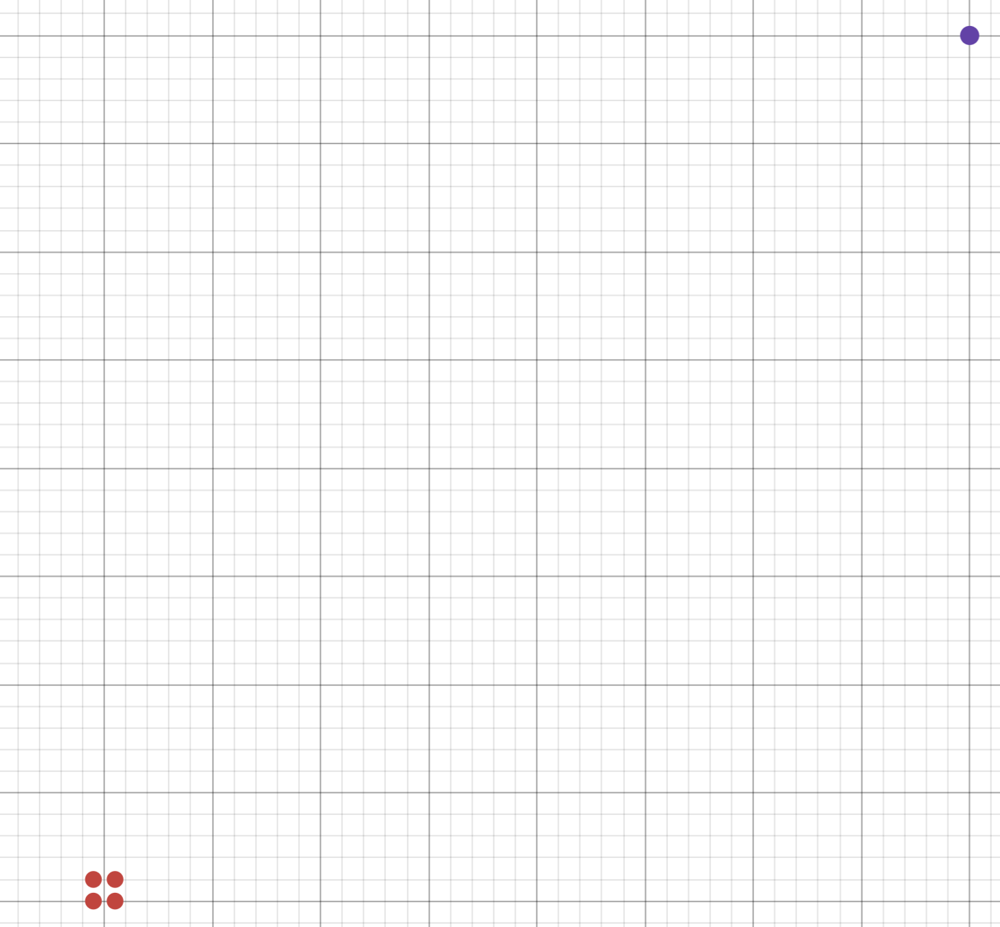

# Single source microphone data

The mp3 files in the folder holds a recording of audio from a single source.
It was generated using pyroomacoustics.

## Room Dimensions

- X: 10.00 m
- Y: 10.00 m
- Z: 3.00 m

## Sampling Frequency

8000 Hz

## Microphone Positions

- Microphone 1: (4.95, 5.10, 1.75)
- Microphone 2: (5.05, 5.10, 1.75)
- Microphone 3: (5.05, 5.00, 1.75)
- Microphone 4: (4.95, 5.00, 1.75)

    

The red is the microphones and the purple is the audio source.
The audio source is approximately 315 degrees from the origin of the microphone array.

## Sound Sources

Number of sources: 1

### Source 1

- Position: (9.00, 9.00, 1.00)
- Signal length: 38081 samples (4.760 seconds)
- Delay: 0 seconds
